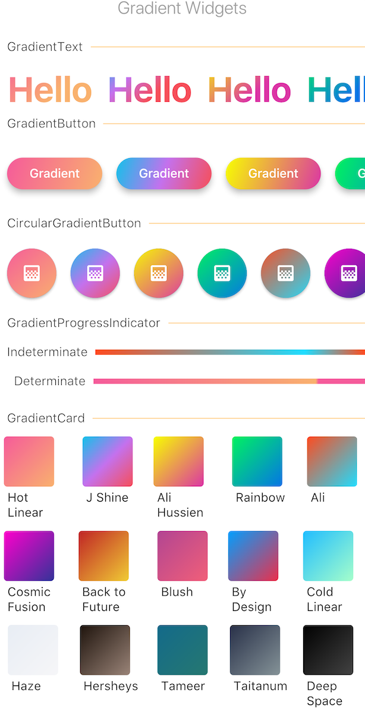

[](https://pub.dartlang.org/packages/gradient_widgets)





## Installation
In your `pubspec.yaml` root add:

```yaml
dependencies:
  gradient_widgets: ^0.3.0
```

then,

`import 'package:gradient_widgets/gradient_widgets.dart';`


## Gradient Widgets

A minimal set of Flutter widgets encased with beautiful gradients.

You can use them when your UI needs user attention/focus,
, e.g., login or send actions, or important shopping item title (see [Gradient Screens](https://github.com/bluemix/Gradient-Screens) to get the idea 😉)


☑️ GradientText

☑️ GradientCard

☑️ GradientButton

☑️ CircularGradientButton

☑️ GradientProgressIndicator

◻️ CircularGradientProgressIndicator


## Usage


### `GradientCard`

```
GradientCard(gradient: Gradients.tameer);
```

most parameters are the same as the `Card`.


### `GradientProgressIndicator`


> must be gradient.colors.length = 2

indeterminate
```
GradientProgressIndicator(
                  gradient: Gradients.rainbowBlue,
                );
```


determinate
```
GradientProgressIndicator(
                  gradient: Gradients.rainbowBlue,
                  value: 0.65,
                );
```


### `GradientButton`

```
GradientButton(
                 child: Text('Gradient'),
                 callback: () {},
                 gradient: Gradients.backToFuture,
           ),

```
most parameters are the same as any `*Button`.


### `CircularGradientButton`


```
CircularGradientButton(
                 child: Icon(Icons.gradient),
                 callback: (){},
                 gradient: Gradients.rainbowBlue,
           ),

```

most parameters are the same as `FloatingActionButton`.


### `GradientText`

```
GradientText('Hello',
             shaderRect: Rect.fromLTWH(0.0, 0.0, 50.0, 50.0),
             gradient: Gradients.hotLinear,
             style: TextStyle(fontSize: 40.0,),);
```

all parameters are the same as the `Text`.


## Getting Started

For help getting started with Flutter, view our online [documentation](https://flutter.io/).

For help on editing package code, view the [documentation](https://flutter.io/developing-packages/).
