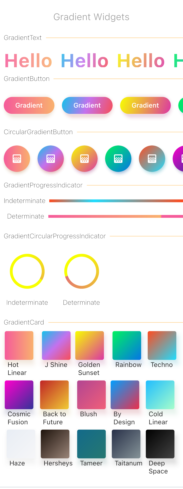

[](https://pub.dartlang.org/packages/gradient_widgets)





## Gradient Widgets

> As of ^0.5.0, `shadowColor` is available for gradient buttons and cards 

A minimal set of Flutter widgets encased with beautiful gradients.

You can use them when your UI needs user attention/focus,
, e.g., login or send actions, or important shopping item title (see [Gradient Screens](https://github.com/bluemix/Gradient-Screens) to get the idea 😉)


☑️ GradientText

☑️ GradientCard

☑️ GradientButton

☑️ CircularGradientButton + Shadow Color

☑️ GradientProgressIndicator

◻️ CircularGradientProgressIndicator

◻️ GradientAppBar


## Installation
In your `pubspec.yaml` root add:

```yaml
dependencies:
  gradient_widgets: ^0.5.1
```

then,

```dart
import 'package:gradient_widgets/gradient_widgets.dart';
```


## Usage


### Card + Gradient

```dart
GradientCard(
    gradient: Gradients.tameer,
    shadowColor: Gradients.tameer.colors.last.withOpacity(0.25),
    elevation: 8,
);
```

most parameters are the same as the `Card`.


### Progress Indicator + Gradient


> must be gradient.colors.length = 2

indeterminate
```dart
GradientProgressIndicator(gradient: Gradients.rainbowBlue,);
```


determinate
```dart
GradientProgressIndicator(
  gradient: Gradients.rainbowBlue,
  value: 0.65,
);
```


### Normal Button + Gradient

```dart
GradientButton(
  child: Text('Gradient'),
  callback: () {},
  gradient: Gradients.backToFuture,
  shadowColor: Gradients.backToFuture.colors.last.withOpacity(0.25),
),

```
most parameters are the same as any `*Button`.


### Circular Button + Gradient


```dart
CircularGradientButton(
  child: Icon(Icons.gradient),
  callback: (){},
  gradient: Gradients.rainbowBlue,
  shadowColor: Gradients.rainbowBlue.colors.last.withOpacity(0.5),
),

```

most parameters are the same as `FloatingActionButton`.


### Text + Gradient

```dart
GradientText(
  'Hello',
  shaderRect: Rect.fromLTWH(0.0, 0.0, 50.0, 50.0),
  gradient: Gradients.hotLinear,
  style: TextStyle(fontSize: 40.0,),
),
```

all parameters are the same as the `Text`.


-----------

#### Getting Started

For help getting started with Flutter, view our online [documentation](https://flutter.io/).

For help on editing package code, view the [documentation](https://flutter.io/developing-packages/).
